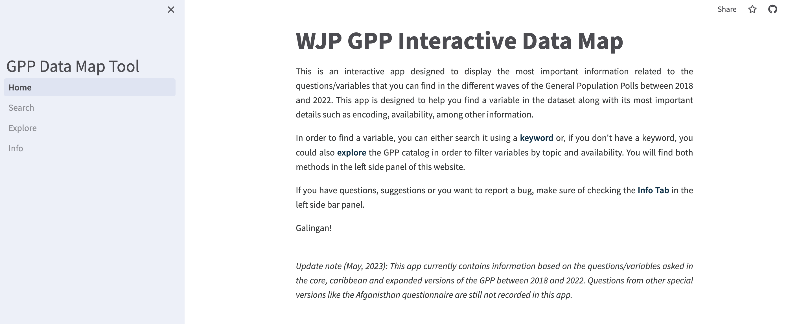

# WJP GPP Interactive Data Map

Python repository containing the source code for the an interactive tool that allows the user to quickly locate and get information on questions from the General Population Polls gathered by the World Justice Project. The app was programmed entirely in Python using the [Streamlit](https://streamlit.io/) web framework. 

* Last available version: May 8th, 2023

## Filing system
The tool is designed to be a multipage app. As such, in the root directory you will find the `1_Home.py` script containing the code for the home page of the app, while in the `/pages/` sub-directory you can find the cod for the remaining pages of the app. In the `/Data/` sub-directory you can find the data that serves as baase for the app as CSV files. A `styles.css` file is added for aesthetic purposes.

## Deployment
The app has been deployed online using the [Streamlit Community Cloud](https://streamlit.io/cloud) services and can be found in [this link](https://gpp-datamap.streamlit.app/).

## Disclaimer:
The information provided in this online tool is for general informational purposes only. While the previously stated author(s) strive to provide accurate and up-to-date information, we make no representations or warranties of any kind, express or implied, about the completeness, accuracy, reliability, suitability, or availability with respect to the information, products, services, or related data contained in this app for any purpose. Any reliance you place on such information is therefore strictly at your own risk.

Please note that the data presented in this online tool SHOULD NOT be taken as official information from the World Justice Project, and any errors or omissions are solely the responsibility of the previously stated author(s). For the latest official information available you should visit the [official website of the World Justice Project](https://worldjusticeproject.org/).

This online tool is a personal project of the previously stated author(s). Every effort is made to keep the tool up and running smoothly. The World Justice Project takes no responsibility for, nor will be liable for any information displayed in this app or by the unavailability or interruption in its service.

The inclusion of any links in this online tool does not necessarily imply a recommendation or endorse the views expressed within them.

## License:
The GPP Data Map Tool is an open-source application that is licensed under the Creative Commons Attribution-NonCommercial 4.0 International license. This means that anyone is free to use, modify, and distribute the software, subject to the terms and conditions of the previously stated license. By using this online tool, you acknowledge and agree to be bound by the terms and conditions of the Attribution-NonCommercial 4.0 International (CC BY-NC 4.0) license.
